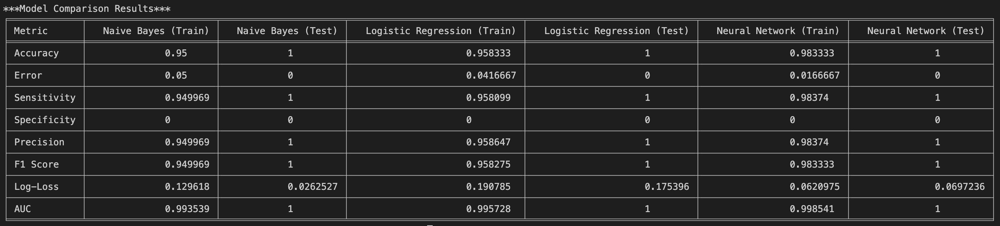

# Iris Flower Classification

This project trains and compares three classifiers on the classic Iris dataset:

- Gaussian Naive Bayes
- `SGDClassifier` with `log_loss` as a linear logistic model
- `MLPClassifier` as a small feed-forward neural network

The script handles basic dataset inspection, label encoding, train/test splitting, feature scaling for the linear model, metric reporting, and plot generation.

## What the project does

`main.py` runs a full end-to-end classification workflow:

1. Loads `iris/iris.data`
2. Assigns column names to the four flower measurements plus class label
3. Checks shape, sample rows, duplicates, and missing values
4. Encodes species labels into numeric classes
5. Splits the data into 80% training and 20% test sets
6. Standardizes features for the SGD-based logistic model
7. Trains the three models
8. Evaluates each model on both training and test data
9. Prints a comparison table with:

- Accuracy
- Error
- Sensitivity
- Specificity
- Precision
- F1 score
- Log-loss
- ROC AUC

It also saves visual output under `Data Visualization/`, including:

- A pairplot of the preprocessed dataset
- A confusion matrix for the training set
- A confusion matrix for the test set

It also produces a saved model-comparison output image at `iris-comparison-models.png`.

## Project layout

`main.py` contains the full training and evaluation pipeline.

`iris/` contains the local copy of the Iris dataset and metadata.

`Data Visualization/` contains generated plots from previous runs.

`Steps` is a short outline of the machine learning workflow used in the project.

## Requirements

This project uses Python 3.10 and a local virtual environment in `.venv`.

Create the environment:

```bash
python3 -m venv .venv
```

Activate it:

```bash
source .venv/bin/activate
```

Install the dependencies:

```bash
pip install -r requirements.txt
```

## How to run

From the project root:

```bash
source .venv/bin/activate
python3 main.py
```

The script prints the original dataset, preprocessing checks, per-model evaluation output, and a final comparison table in the terminal.

## Results

Console log of Model Comparison result:


Generated visualization charts:
### Preprocessed Dataset Pairplot


### Training Set Confusion Matrix


### Test Set Confusion Matrix


## Dataset

This repo uses the local Iris dataset stored in [`iris/iris.data`](/Users/jeromeazicate/Desktop/IrisFlowerClassification/iris/iris.data). The accompanying metadata in [`iris/iris.names`](/Users/jeromeazicate/Desktop/IrisFlowerClassification/iris/iris.names) describes 150 samples across three species:

- Iris-setosa
- Iris-versicolor
- Iris-virginica

Each sample includes four numeric features:

- Sepal length
- Sepal width
- Petal length
- Petal width

## Notes

- The "logistic regression" model in this project is implemented with `SGDClassifier(loss='log_loss')`, not `LogisticRegression`.
- Feature scaling is applied only to the SGD-based model.
- The current evaluation logic reports specificity as `0` for this multiclass problem because the code only computes it for a binary confusion matrix.
